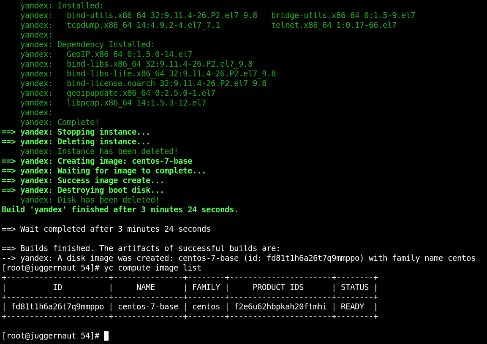
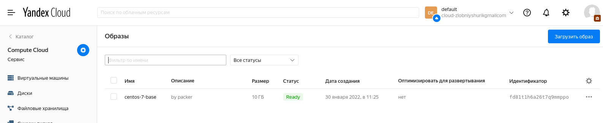
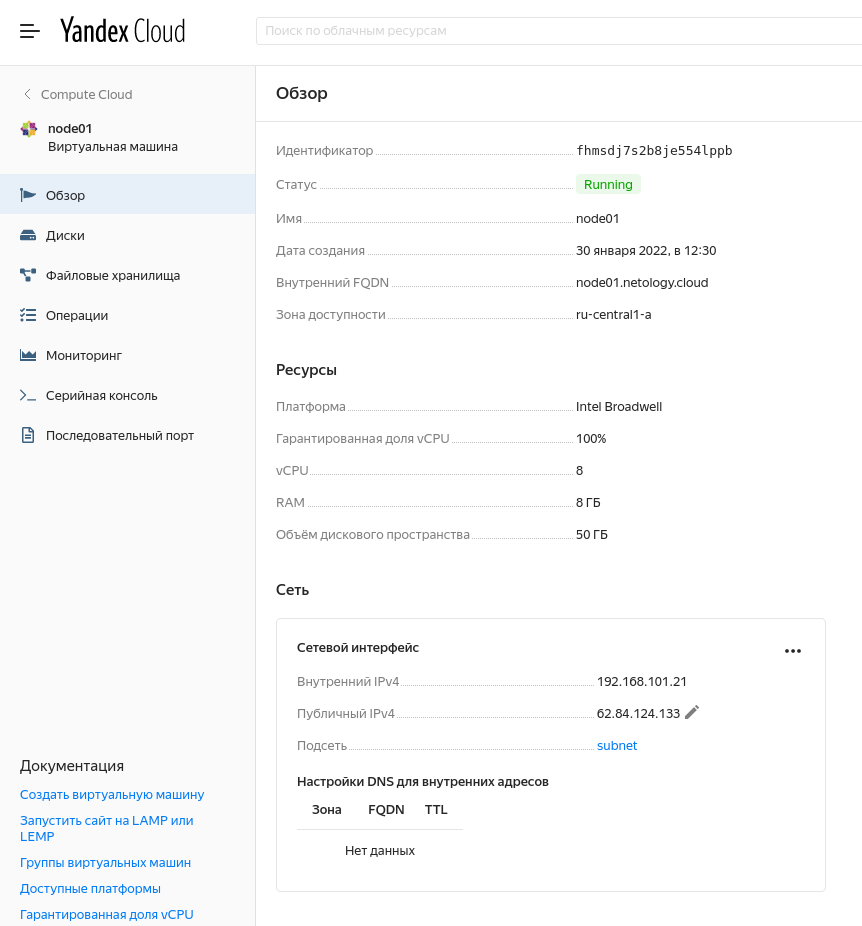
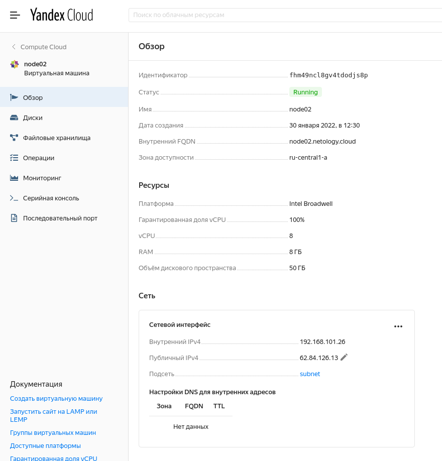
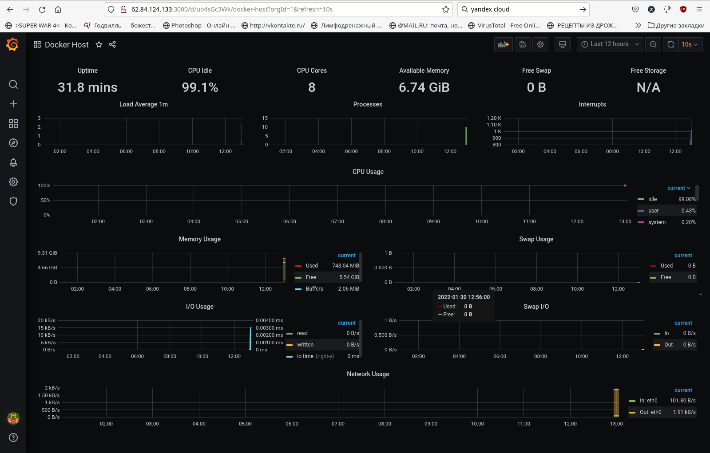

# Домашнее задание к занятию "5.4. Оркестрация группой Docker контейнеров на примере Docker Compose"

## Как сдавать задания

*Обязательными к выполнению являются задачи без указания звездочки. Их выполнение необходимо для получения зачета и диплома о профессиональной переподготовке.*

*Задачи со звездочкой (*) являются дополнительными задачами и/или задачами повышенной сложности. Они не являются обязательными к выполнению, но помогут вам глубже понять тему.*

*Домашнее задание выполните в файле readme.md в github репозитории. В личном кабинете отправьте на проверку ссылку на .md-файл в вашем репозитории.*

*Любые вопросы по решению задач задавайте в чате учебной группы.*

---

## Задача 1

*Создать собственный образ операционной системы с помощью Packer.*

*Для получения зачета, вам необходимо предоставить:*
- *Скриншот страницы, как на слайде из презентации (слайд 37).*

**Скриншот результата работы packer`а**

**Скриншот образа в Yandex Cloud`е**

## Задача 2

*Создать вашу первую виртуальную машину в Яндекс.Облаке.*

*Для получения зачета, вам необходимо предоставить:*
- *Скриншот страницы свойств созданной ВМ, как на примере ниже:*

  

**Сразу клепаем пару нод - чего мелочиться?**  
**Нода 01 (основная):**  

**Нода 02 (пригодится для подзадачи 4):**  

## Задача 3

*Создать ваш первый готовый к боевой эксплуатации компонент мониторинга, состоящий из стека микросервисов.*

*Для получения зачета, вам необходимо предоставить:*
- *Скриншот работающего веб-интерфейса Grafana с текущими метриками, как на примере ниже*

  

**Нода 01 с запущенной Grafana:**  

## Задача 4 (*)

*Создать вторую ВМ и подключить её к мониторингу развёрнутому на первом сервере.*

*Для получения зачета, вам необходимо предоставить:*
- *Скриншот из Grafana, на котором будут отображаться метрики добавленного вами сервера.*

**Ниасилил - создать и развернуть вторую ноду получилось без проблем.**

**Но вот скормить данные от Прометеуса  Ноды N2 Графане на Ноде N1 не получилось - авторизацию просит.**

**А где авторизация там настраивается и почему локально работает без каких-либо дополнительных настроек - непонятно, а я Графану с Прометеусом второй раз в жизни вижу.**

