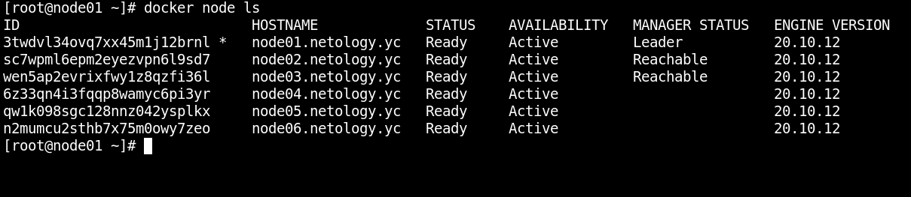
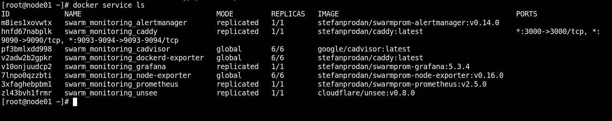
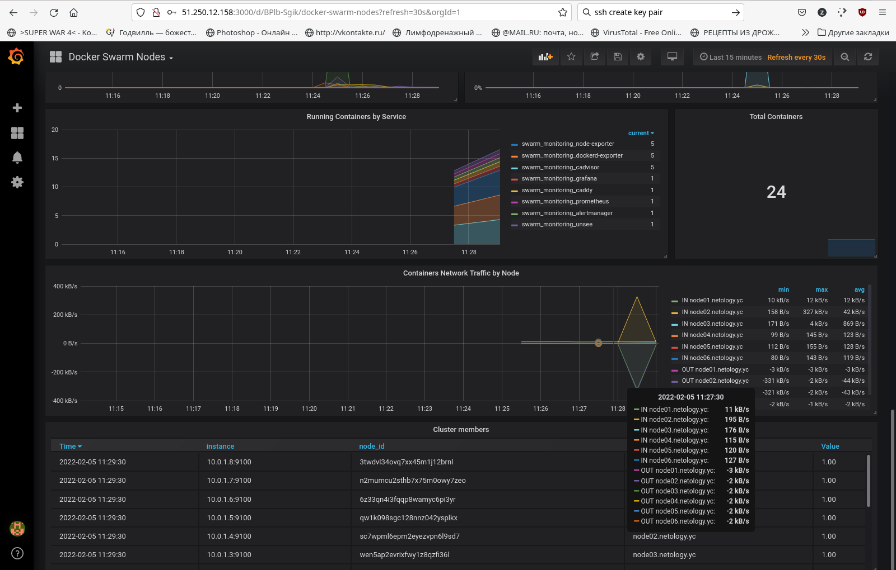

# Домашнее задание к занятию "5.5. Оркестрация кластером Docker контейнеров на примере Docker Swarm"

## Как сдавать задания

*Обязательными к выполнению являются задачи без указания звездочки. Их выполнение необходимо для получения зачета и диплома о профессиональной переподготовке.*

*Задачи со звездочкой (\*) являются дополнительными задачами и/или задачами повышенной сложности. Они не являются обязательными к выполнению, но помогут вам глубже понять тему.*

*Домашнее задание выполните в файле readme.md в github репозитории. В личном кабинете отправьте на проверку ссылку на .md-файл в вашем репозитории.*

*Любые вопросы по решению задач задавайте в чате учебной группы.*

---

## Задача 1

*Дайте письменые ответы на следующие вопросы:*

- *В чём отличие режимов работы сервисов в Docker Swarm кластере: replication и global?*
- *Какой алгоритм выбора лидера используется в Docker Swarm кластере?*
- *Что такое Overlay Network?*

## Задача 2

*Создать ваш первый Docker Swarm кластер в Яндекс.Облаке*

*Для получения зачета, вам необходимо предоставить скриншот из терминала (консоли), с выводом команды:*
```
docker node ls
```

Сделано, с третьей попытки, но заработало...  


## Задача 3

*Создать ваш первый, готовый к боевой эксплуатации кластер мониторинга, состоящий из стека микросервисов.*

*Для получения зачета, вам необходимо предоставить скриншот из терминала (консоли), с выводом команды:*
```
docker service ls
```

Работает...  


...и даже красивые картинки рисует  


## Задача 4 (*)

*Выполнить на лидере Docker Swarm кластера команду (указанную ниже) и дать письменное описание её функционала, что она делает и зачем она нужна:*
```
# см.документацию: https://docs.docker.com/engine/swarm/swarm_manager_locking/
docker swarm update --autolock=true
```
