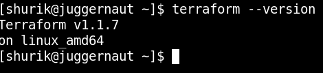
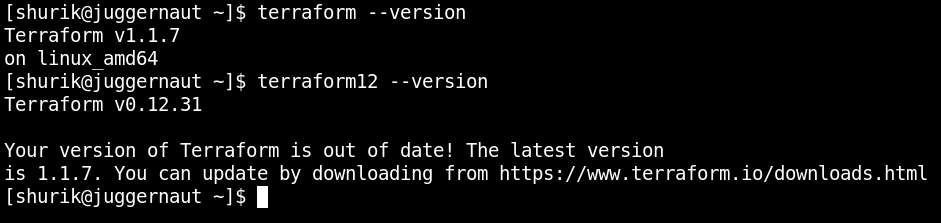

# Домашнее задание к занятию "7.1. Инфраструктура как код"

## Задача 1. Выбор инструментов. 
 
### Легенда
 
*Через час совещание на котором менеджер расскажет о новом проекте. Начать работу над которым надо 
будет уже сегодня. 
На данный момент известно, что это будет сервис, который ваша компания будет предоставлять внешним заказчикам.
Первое время, скорее всего, будет один внешний клиент, со временем внешних клиентов станет больше.*

*Так же по разговорам в компании есть вероятность, что техническое задание еще не четкое, что приведет к большому
количеству небольших релизов, тестирований интеграций, откатов, доработок, то есть скучно не будет.*  
   
*Вам, как девопс инженеру, будет необходимо принять решение об инструментах для организации инфраструктуры.
На данный момент в вашей компании уже используются следующие инструменты:*
- *остатки Сloud Formation,*
- *некоторые образы сделаны при помощи Packer,*
- *год назад начали активно использовать Terraform,*
- *разработчики привыкли использовать Docker,*
- *уже есть большая база Kubernetes конфигураций,*
- *для автоматизации процессов используется Teamcity,*
- *также есть совсем немного Ansible скриптов,*
- *и ряд bash скриптов для упрощения рутинных задач.* 

*Для этого в рамках совещания надо будет выяснить подробности о проекте, что бы в итоге определиться с инструментами:*

1. *Какой тип инфраструктуры будем использовать для этого проекта: изменяемый или не изменяемый?*  
**Учитывая современные тенденции, засилье Docker'а и прочих Kubernetes'ов, выбора нам не остаётся - на основных серверах, предоставляющих сервис клиентам, только неизменяемая инфраструктура.**  
**А вот на вспомогательных серверах можно и порезвиться.**
1. *Будет ли центральный сервер для управления инфраструктурой?*  
**Скорее не сервер, а целый кластер. Мастер-ноды того же kubernetes'а вполне под это определение подходят.**
1. *Будут ли агенты на серверах?*  
**С вероятностью в 99 процентов - нет.**  
**Ansible и Terraform агентами не пользуются. Да и с установкой агентов появляется лишняя точка отказа, плюс этими самыми агентами тоже заниматься надо - устанавливать, обновлять, следить за их функционированием.**
1. *Будут ли использованы средства для управления конфигурацией или инициализации ресурсов?*  
**В Teamcity, если верить документации, одна из основных функций - управление конфигурацией. Следовательно, у нас уже есть средствo для управления конфигурацией.**
 
*В связи с тем, что проект стартует уже сегодня, в рамках совещания надо будет определиться со всеми этими вопросами.*  

### В результате задачи необходимо

1. *Ответить на четыре вопроса представленных в разделе "Легенда".* 
1. *Какие инструменты из уже используемых вы хотели бы использовать для нового проекта?*  
**Kubernetes, Terraform, Ansible.**
1. *Хотите ли рассмотреть возможность внедрения новых инструментов для этого проекта?*  
**Практически 100% вероятность, что всплыёт потребность в тех или иных инструментах, которые исходно не предусмотрели. Так что возможность внедрения придётся не только рассмотреть, но и зарезервировать под это дело часть мощностей и специалистов.**

*Если для ответа на эти вопросы недостаточно информации, то напишите какие моменты уточните на совещании.*  
**На всякий случай уточню - как у нас со специалистами с опытом работы с теми или иными инструментами?  
Закладываться целиком на решение на основе продукта "X" без наличия критической массы спецов, что с этим продуктом умеют работать, мягко говоря, опрометчиво.**

## Задача 2. Установка терраформ. 

*Официальный сайт: https://www.terraform.io/*

*Установите терраформ при помощи менеджера пакетов используемого в вашей операционной системе.
В виде результата этой задачи приложите вывод команды `terraform --version`.*

**Если честно, то оно уже давным-давно поставлено:**  


## Задача 3. Поддержка легаси кода. 

*В какой-то момент вы обновили терраформ до новой версии, например с 0.12 до 0.13.* 
*А код одного из проектов настолько устарел, что не может работать с версией 0.13.* 
*В связи с этим необходимо сделать так, чтобы вы могли одновременно использовать последнюю версию терраформа установленную при помощи
штатного менеджера пакетов и устаревшую версию 0.12.* 

*В виде результата этой задачи приложите вывод `--version` двух версий терраформа доступных на вашем компьютере 
или виртуальной машине.*

**Воспользуемся тем, что *terraform* - большой и толстый одинокий бинарник:**

1. **Скачиваем и распаковываем бинарник старой версии *(возьмём версию 0.12)* в любую удобную папку, например, `/opt/tf12`**
2. **Для пущего удобства сделаем линк на бинарник старой версии:**
```bash
ln -s /opt/tf12/terraform /usr/bin/terraform12
chmod ugo+x /usr/bin/terraform*
```
3. **Готово:**  


---

### Как cдавать задание

Выполненное домашнее задание пришлите ссылкой на .md-файл в вашем репозитории.

---
