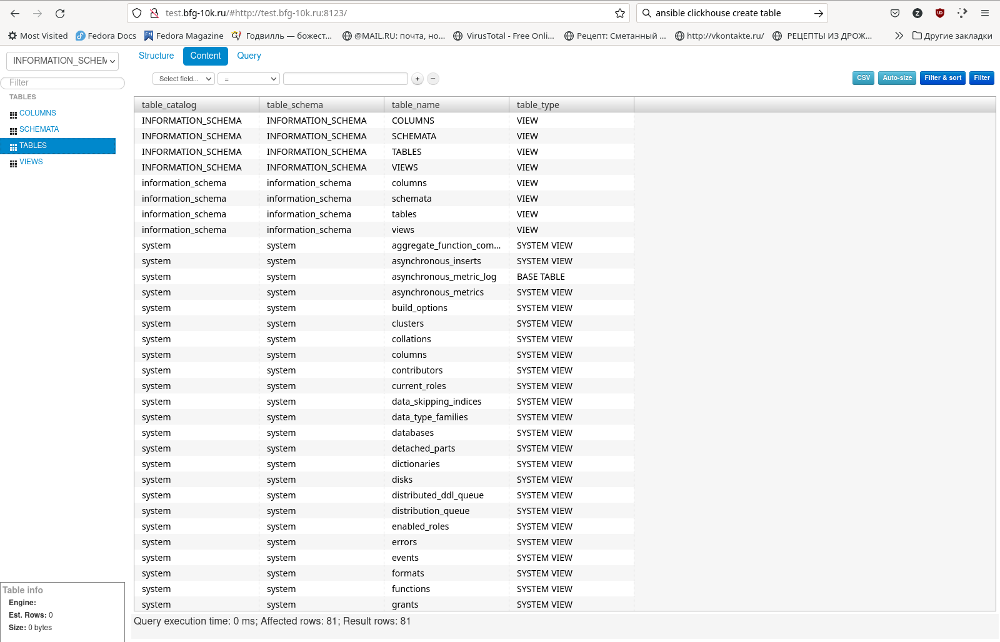

Краткое описание
=================

1. Устанавливаем роли для:
  - **nginx** *(в качестве веб-сервера под **Lighthouse**)*
  - **Lighthouse** *(в качестве веб-интерфейса для **Clickhouse**)*
  - **Clickhouse** *(а ля база данных)*
  - **Vector** *(в идеале, должен был скидывать логи в БД)*

2. Перебрасываем `Lighthouse` из временной директории в каталог веб-сервера и настраиваем фаервол 
*(На этом этапе связка из `nginx` и `Lighthouse` уже полностью работоспособна)*

3. Скармливаем `Clickhouse` файл с конфигами настроек пользователей и перезапускаем `Clickhouse`-сервер.  
*(Убедить его работать так, как мне надо, только через переменные для ролей полностью не удалось)*

4. В принципе, на этом этапе уже можно посмотреть внутренности БД `Clickhouse`

5. `Vector` как бы тоже живой, но вот настраивать его так, чтобы он генерил данные, трансформировал их и сливал в `Clickhouse`, честно говоря, не вижу смысла - получится трехэтажный плейбук с подключением к БД, созданию таблиц, пользователей, прописывания им разрешений, e.t.c.  
Потратим кучу времени и получим результат мало относящийся к теме ДЗ (собственно, изучение использования ролей `Ansible` в playbook'ах).  
*(Да и, в конце концов, настройки `Vector`а в ДЗ и не требовали, а готовых шаблонов не предоставили)*
