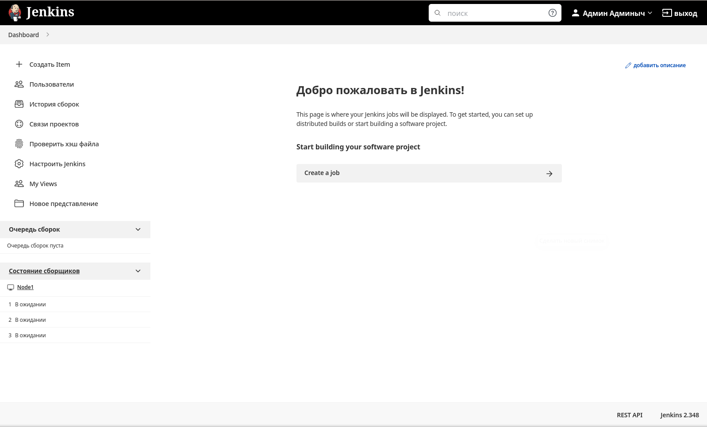

# Домашнее задание к занятию "09.03 Jenkins"

## Подготовка к выполнению

1. *Установить jenkins по любой из [инструкций](https://www.jenkins.io/download/)*  
**"В лоб" поставить `Jenkins` не получилось - софтине не понравились ни 8ая, ни 11ая, ни 17ая версии уже установленной `Java`. Пишет `Invalid version`**  
**Ставим через докер:**  
```bash
docker pull jenkins/jenkins:lts-jdk11
docker run -d -v jenkins_home:/var/jenkins_home -p 8080:8080 -p 50000:50000 --restart always jenkins/jenkins:lts-jdk11
```
***В данном случае `Jenkins` запускается в detached-режиме на порту `8080` и сохраняет все свои данные в автоматом создаваемом томе `jenkins_home`. Порт `50000` - для внешних агентов.***  
**Временный пароль админа для дальнейшей настройки можно подсмотреть в логах по команде:**  
```bash
docker logs CONTAINER_ID
```  

2. *Запустить и проверить работоспособность*  
**Вроде как, запустился (плагины поставил по умолчанию):**  


3. *Сделать первоначальную настройку*
4. *Настроить под свои нужды*
5. *Поднять отдельный cloud*
6. *Для динамических агентов можно использовать [образ](https://hub.docker.com/repository/docker/aragast/agent)*
7. *Обязательный параметр: поставить label для динамических агентов: `ansible_docker`*
8. *Сделать форк репозитория с [playbook](https://github.com/aragastmatb/example-playbook)*

## Основная часть

1. *Сделать Freestyle Job, который будет запускать `ansible-playbook` из форка репозитория*
2. *Сделать Declarative Pipeline, который будет выкачивать репозиторий с плейбукой и запускать её*
3. *Перенести Declarative Pipeline в репозиторий в файл `Jenkinsfile`*
4. *Перенастроить Job на использование `Jenkinsfile` из репозитория*
5. *Создать Scripted Pipeline, наполнить его скриптом из [pipeline](./pipeline)*
6. *Заменить credentialsId на свой собственный*
7. *Проверить работоспособность, исправить ошибки, исправленный Pipeline вложить в репозитрий в файл `ScriptedJenkinsfile`*
8. *Отправить ссылку на репозиторий в ответе*

## Необязательная часть

1. *Создать скрипт на groovy, который будет собирать все Job, которые завершились хотя бы раз неуспешно. Добавить скрипт в репозиторий с решеним с названием `AllJobFailure.groovy`*
2. *Установить customtools plugin*
3. *Поднять инстанс с локальным nexus, выложить туда в анонимный доступ  .tar.gz с `ansible`  версии 2.9.x*
4. *Создать джобу, которая будет использовать `ansible` из `customtool`*
5. *Джоба должна просто исполнять команду `ansible --version`, в ответ прислать лог исполнения джобы* 

---

### Как оформить ДЗ?

*Выполненное домашнее задание пришлите ссылкой на .md-файл в вашем репозитории.*

---
