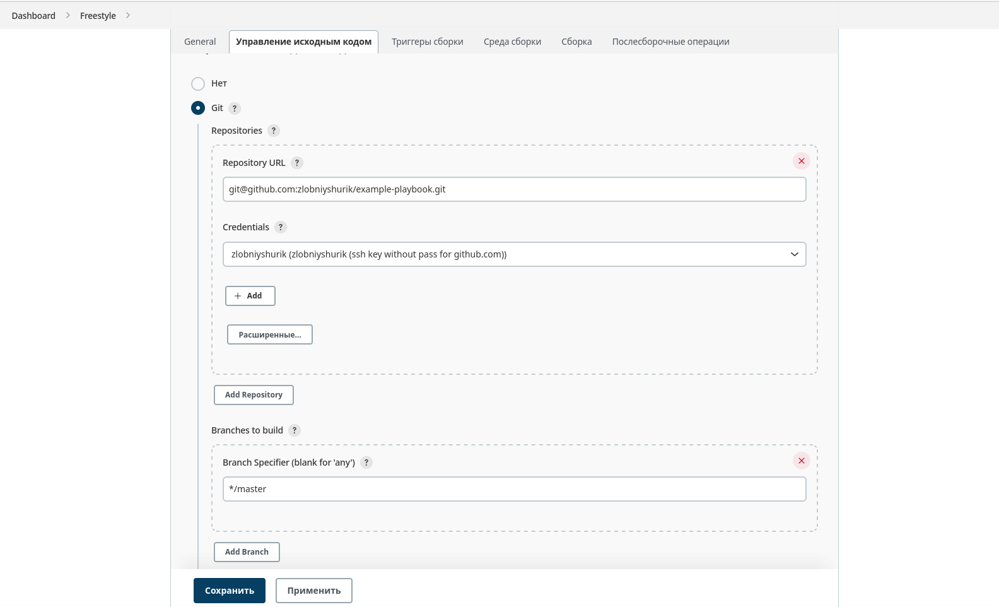
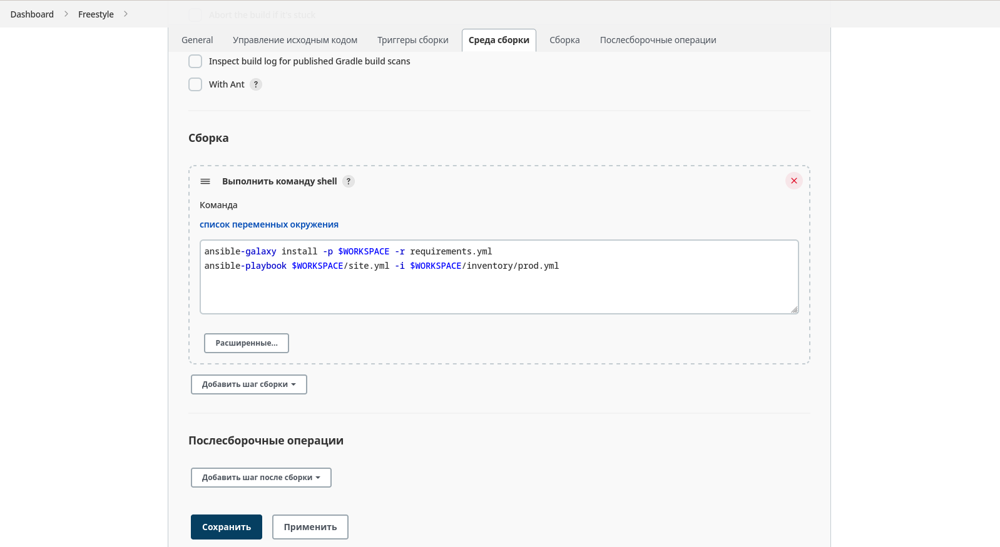

# Домашнее задание к занятию "09.03 Jenkins"

## Подготовка к выполнению

1. *Установить jenkins по любой из [инструкций](https://www.jenkins.io/download/)*  

***Как оказалось, через docker `Jenkins` работает криво - запускается, но установленные плагины не работают толком - похоже, не хватает системных компонентов в образе.***  

**В "лоб" `Jenkins` удалось таки поставить, но только после сноса 17ой `Java` - он её почему-то не переваривает.**  

***Стыд и позор ретроградам и геронтофилам!***  

```bash
wget -O /etc/yum.repos.d/jenkins.repo https://pkg.jenkins.io/redhat-stable/jenkins.repo
rpm --import https://pkg.jenkins.io/redhat-stable/jenkins.io.key
dnf upgrade
dnf install java-11-openjdk-headless fontconfig
dnf install jenkins
systemctl daemon-reload
systemctl enable jenkins
systemctl start jenkins
systemctl status jenkins
```
----
2. *Запустить и проверить работоспособность*  

**Вроде как, запустился (плагины поставил по умолчанию):**  
****  

----
3. *Сделать первоначальную настройку*

**Отключаем сборщики на мастер-ноде, выставив их количество в ноль, дабы `Jenkins` не ругался на безопасность**  

----
4. *Настроить под свои нужды*  

**Ну какие могут быть настройки под себя, если я это чудо впервые в жизни вижу?**  

----

5. *Поднять отдельный cloud*  

***Не забываем добавить в `Jenkins` плагин для работы с `libvirt`ом.***  

**В качестве облака подключимся через `libvirt` к домашней тестовой QEMU-KVM-ферме, которая живёт на той же машине, где и мастер-сервер `Jenkins`а поставили.**  

----
6. *Для динамических агентов можно использовать [образ](https://hub.docker.com/repository/docker/aragast/agent)*  

***Чудесно! Какой-то неизвестный образ без никакой документации, что с ним делать, как запускать - поди догадайся! Не будем его трогать.***  

***Не забываем добавить `jenkins` в группу 'libvirt' на мастер-сервере и обменяться ssh-ключами между мастер-сервером и нодой***

**Если есть своё облако, им и будем пользоваться - запускаем на нём ноду из минимальной инсталляции `Alma Linux 8.6` с установленной туда 11 версией `Java`.**  

***Спасибо [этой статье](https://acloudguru.com/blog/engineering/adding-a-jenkins-agent-node)***

**Итого:**  
****

----
7. *Обязательный параметр: поставить label для динамических агентов: `ansible_docker`*  

**Если нужно - сделаем:**  
****

----
8. *Сделать форк репозитория с [playbook](https://github.com/aragastmatb/example-playbook)*

**[Форкнул](https://github.com/zlobniyshurik/example-playbook)**  

----

## Основная часть

----
1. *Сделать Freestyle Job, который будет запускать `ansible-playbook` из форка репозитория*

**В качестве источника вдохновения воспользуемся [этой статьёй](https://www.guru99.com/create-builds-jenkins-freestyle-project.html)**  

**Как-то так:**  
  

**Затем так:**  
  

**Далее скрипт для запуска плейбуков:**  
  

**И результат всего этого безобразия (вывод на консоль):**  
```
Started by user Админ Админыч
Running as SYSTEM
Собирается удаленно на Node1 (ansible_docker) in workspace /var/lib/jenkins/workspace/Freestyle
The recommended git tool is: NONE
using credential 67e4edd5-44a3-432a-a456-f6a05d7015b1
Cloning the remote Git repository
Cloning repository git@github.com:zlobniyshurik/example-playbook.git
 > git init /var/lib/jenkins/workspace/Freestyle # timeout=10
Fetching upstream changes from git@github.com:zlobniyshurik/example-playbook.git
 > git --version # timeout=10
 > git --version # 'git version 2.36.1'
using GIT_SSH to set credentials zlobniyshurik (ssh key without pass for github.com)
[INFO] Currently running in a labeled security context
[INFO] Currently SELinux is 'enforcing' on the host
 > /usr/bin/chcon --type=ssh_home_t /var/lib/jenkins/workspace/Freestyle@tmp/jenkins-gitclient-ssh10240156313243231486.key
 > git fetch --tags --force --progress -- git@github.com:zlobniyshurik/example-playbook.git +refs/heads/*:refs/remotes/origin/* # timeout=10
 > git config remote.origin.url git@github.com:zlobniyshurik/example-playbook.git # timeout=10
 > git config --add remote.origin.fetch +refs/heads/*:refs/remotes/origin/* # timeout=10
Avoid second fetch
 > git rev-parse refs/remotes/origin/master^{commit} # timeout=10
Checking out Revision e5660f16a6ad9df2e800723763e1cce459fcdc76 (refs/remotes/origin/master)
 > git config core.sparsecheckout # timeout=10
 > git checkout -f e5660f16a6ad9df2e800723763e1cce459fcdc76 # timeout=10
Commit message: "Update Jenkinsfile"
First time build. Skipping changelog.
[Freestyle] $ /bin/sh -xe /tmp/jenkins13421323691567904281.sh
+ ansible-galaxy install -p /var/lib/jenkins/workspace/Freestyle -r requirements.yml
Starting galaxy role install process
- extracting java to /var/lib/jenkins/workspace/Freestyle/java
- java (1.0.1) was installed successfully
+ ansible-playbook /var/lib/jenkins/workspace/Freestyle/site.yml -i /var/lib/jenkins/workspace/Freestyle/inventory/prod.yml

PLAY [Install Java] ************************************************************

TASK [Gathering Facts] *********************************************************
ok: [localhost]

TASK [java : Upload .tar.gz file containing binaries from local storage] *******
skipping: [localhost]

TASK [java : Upload .tar.gz file conaining binaries from remote storage] *******
changed: [localhost]

TASK [java : Ensure installation dir exists] ***********************************
changed: [localhost]

TASK [java : Extract java in the installation directory] ***********************
changed: [localhost]

TASK [java : Export environment variables] *************************************
changed: [localhost]

PLAY RECAP *********************************************************************
localhost                  : ok=5    changed=4    unreachable=0    failed=0    skipped=1    rescued=0    ignored=0   

Finished: SUCCESS
```
----
2. *Сделать Declarative Pipeline, который будет выкачивать репозиторий с плейбукой и запускать её*

**Начало примерно такое же:**
  

**Затем наколеночный скрипт, переделаный из встроенного примера 'Git+Maven':**  
```
pipeline {
    agent any
    stages {
        stage('Get code from GitHub') {
            steps {
                // Get some code from a GitHub repository
                git 'git@github.com:zlobniyshurik/example-playbook.git'
            }
        }
        stage('Run ansible') {
            steps {
                sh 'ansible-galaxy install -p $WORKSPACE -r requirements.yml'
                sh 'ansible-playbook $WORKSPACE/site.yml -i $WORKSPACE/inventory/prod.yml'
            }
        }
    }
}
```

**И результат (вывод на консоль):**  
```
Started by user Админ Админыч
[Pipeline] Start of Pipeline
[Pipeline] node
Running on Node1 in /var/lib/jenkins/workspace/Declarative
[Pipeline] {
[Pipeline] stage
[Pipeline] { (Get code from GitHub)
[Pipeline] git
The recommended git tool is: NONE
No credentials specified
Cloning the remote Git repository
Cloning repository git@github.com:zlobniyshurik/example-playbook.git
 > git init /var/lib/jenkins/workspace/Declarative # timeout=10
Fetching upstream changes from git@github.com:zlobniyshurik/example-playbook.git
 > git --version # timeout=10
 > git --version # 'git version 2.36.1'
 > git fetch --tags --force --progress -- git@github.com:zlobniyshurik/example-playbook.git +refs/heads/*:refs/remotes/origin/* # timeout=10
Avoid second fetch
Checking out Revision e5660f16a6ad9df2e800723763e1cce459fcdc76 (refs/remotes/origin/master)
Commit message: "Update Jenkinsfile"
First time build. Skipping changelog.
[Pipeline] }
[Pipeline] // stage
[Pipeline] stage
[Pipeline] { (Run ansible)
[Pipeline] sh
 > git config remote.origin.url git@github.com:zlobniyshurik/example-playbook.git # timeout=10
 > git config --add remote.origin.fetch +refs/heads/*:refs/remotes/origin/* # timeout=10
 > git rev-parse refs/remotes/origin/master^{commit} # timeout=10
 > git config core.sparsecheckout # timeout=10
 > git checkout -f e5660f16a6ad9df2e800723763e1cce459fcdc76 # timeout=10
 > git branch -a -v --no-abbrev # timeout=10
 > git checkout -b master e5660f16a6ad9df2e800723763e1cce459fcdc76 # timeout=10
+ ansible-galaxy install -p /var/lib/jenkins/workspace/Declarative -r requirements.yml
Starting galaxy role install process
- extracting java to /var/lib/jenkins/workspace/Declarative/java
- java (1.0.1) was installed successfully
[Pipeline] sh
+ ansible-playbook /var/lib/jenkins/workspace/Declarative/site.yml -i /var/lib/jenkins/workspace/Declarative/inventory/prod.yml

PLAY [Install Java] ************************************************************

TASK [Gathering Facts] *********************************************************
ok: [localhost]

TASK [java : Upload .tar.gz file containing binaries from local storage] *******
skipping: [localhost]

TASK [java : Upload .tar.gz file conaining binaries from remote storage] *******
ok: [localhost]

TASK [java : Ensure installation dir exists] ***********************************
ok: [localhost]

TASK [java : Extract java in the installation directory] ***********************
skipping: [localhost]

TASK [java : Export environment variables] *************************************
ok: [localhost]

PLAY RECAP *********************************************************************
localhost                  : ok=4    changed=0    unreachable=0    failed=0    skipped=2    rescued=0    ignored=0   

[Pipeline] }
[Pipeline] // stage
[Pipeline] }
[Pipeline] // node
[Pipeline] End of Pipeline
Finished: SUCCESS
``` 

----
3. *Перенести Declarative Pipeline в репозиторий в файл `Jenkinsfile`*  

**Перенёс в [репозиторий](https://github.com/zlobniyshurik/example-playbook)**  

**Сам текст файла выглядит как-то так:**
```
pipeline {
    agent any
    stages {
        stage('Get code from GitHub') {
            steps {
                // Get some code from a GitHub repository
                git 'git@github.com:zlobniyshurik/example-playbook.git'
            }
        }
        stage('Run ansible') {
            steps {
                sh 'ansible-galaxy install -p $WORKSPACE -r requirements.yml'
                sh 'ansible-playbook $WORKSPACE/site.yml -i $WORKSPACE/inventory/prod.yml'
            }
        }
    }
}
```

----
4. *Перенастроить Job на использование `Jenkinsfile` из репозитория*
5. *Создать Scripted Pipeline, наполнить его скриптом из [pipeline](./pipeline)*
6. *Заменить credentialsId на свой собственный*
7. *Проверить работоспособность, исправить ошибки, исправленный Pipeline вложить в репозитрий в файл `ScriptedJenkinsfile`*
8. *Отправить ссылку на репозиторий в ответе*

## Необязательная часть

1. *Создать скрипт на groovy, который будет собирать все Job, которые завершились хотя бы раз неуспешно. Добавить скрипт в репозиторий с решеним с названием `AllJobFailure.groovy`*
2. *Установить customtools plugin*
3. *Поднять инстанс с локальным nexus, выложить туда в анонимный доступ  .tar.gz с `ansible`  версии 2.9.x*
4. *Создать джобу, которая будет использовать `ansible` из `customtool`*
5. *Джоба должна просто исполнять команду `ansible --version`, в ответ прислать лог исполнения джобы* 

---

### Как оформить ДЗ?

*Выполненное домашнее задание пришлите ссылкой на .md-файл в вашем репозитории.*

---
