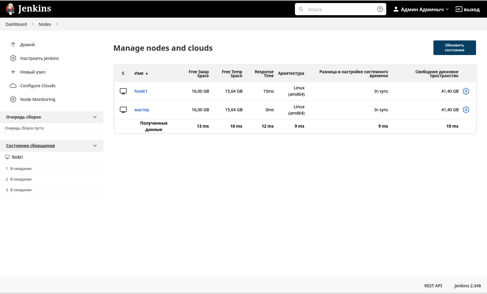

# Домашнее задание к занятию "09.03 Jenkins"

## Подготовка к выполнению

1. *Установить jenkins по любой из [инструкций](https://www.jenkins.io/download/)*  
**Как оказалось, через docker `Jenkins` работает криво - запускается, но установленные плагины не работают толком - похоже, не хватает системных компонентов в образе.**  
**В "лоб" `Jenkins` удалось таки поставить, но только после сноса 17ой `Java` - он её почему-то не переваривает.**  
***Стыд и позор ретроградам и геронтофилам!***  
```bash
wget -O /etc/yum.repos.d/jenkins.repo https://pkg.jenkins.io/redhat-stable/jenkins.repo
rpm --import https://pkg.jenkins.io/redhat-stable/jenkins.io.key
dnf upgrade
dnf install java-11-openjdk-headless
dnf install jenkins
systemctl daemon-reload
systemctl enable jenkins --now
```

2. *Запустить и проверить работоспособность*  
**Вроде как, запустился (плагины поставил по умолчанию):**  
****

3. *Сделать первоначальную настройку*

4. *Настроить под свои нужды*  
**Ну какие могут быть настройки под себя, если я это чудо впервые в жизни вижу?**  

5. *Поднять отдельный cloud*  
**В качестве облака подключимся через `libvirt` к домашней QEMU-KVM-ферме, не забыв добавить плагин для работы с `libvirt`ом.**  

6. *Для динамических агентов можно использовать [образ](https://hub.docker.com/repository/docker/aragast/agent)*  
***Чудесно! Какой-то неизвестный образ без никакой документации, что с ним делать - поди догадайся!***  
**Если есть своё облако, им и будем пользоваться - запускаем на нём ноду из минимальной инсталляции `Alma Linux 8.6` с установленной туда 11 версией `Java`**  
***Спасибо [этой статье](https://acloudguru.com/blog/engineering/adding-a-jenkins-agent-node)***

**Итого:**  
****

7. *Обязательный параметр: поставить label для динамических агентов: `ansible_docker`*
8. *Сделать форк репозитория с [playbook](https://github.com/aragastmatb/example-playbook)*

## Основная часть

1. *Сделать Freestyle Job, который будет запускать `ansible-playbook` из форка репозитория*
2. *Сделать Declarative Pipeline, который будет выкачивать репозиторий с плейбукой и запускать её*
3. *Перенести Declarative Pipeline в репозиторий в файл `Jenkinsfile`*
4. *Перенастроить Job на использование `Jenkinsfile` из репозитория*
5. *Создать Scripted Pipeline, наполнить его скриптом из [pipeline](./pipeline)*
6. *Заменить credentialsId на свой собственный*
7. *Проверить работоспособность, исправить ошибки, исправленный Pipeline вложить в репозитрий в файл `ScriptedJenkinsfile`*
8. *Отправить ссылку на репозиторий в ответе*

## Необязательная часть

1. *Создать скрипт на groovy, который будет собирать все Job, которые завершились хотя бы раз неуспешно. Добавить скрипт в репозиторий с решеним с названием `AllJobFailure.groovy`*
2. *Установить customtools plugin*
3. *Поднять инстанс с локальным nexus, выложить туда в анонимный доступ  .tar.gz с `ansible`  версии 2.9.x*
4. *Создать джобу, которая будет использовать `ansible` из `customtool`*
5. *Джоба должна просто исполнять команду `ansible --version`, в ответ прислать лог исполнения джобы* 

---

### Как оформить ДЗ?

*Выполненное домашнее задание пришлите ссылкой на .md-файл в вашем репозитории.*

---
