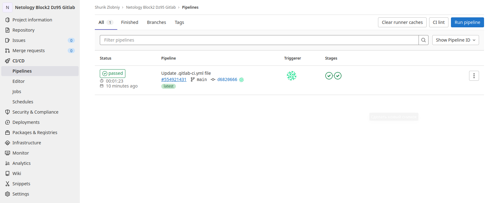
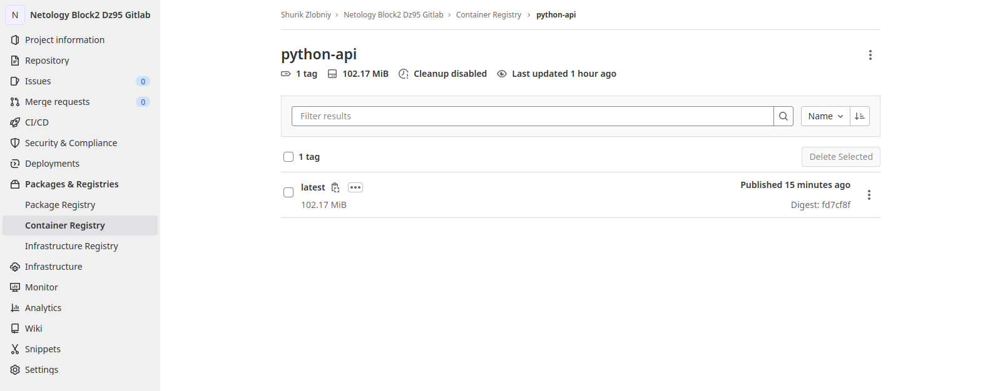

# Домашнее задание к занятию "09.05 Gitlab"

## Подготовка к выполнению

----
1. *Необходимо [зарегистрироваться](https://about.gitlab.com/free-trial/)*

**Уже зарегистрирован.**

----
2. *Создайте свой новый проект*

**[Сделано](https://gitlab.com/ZlobniyShurik/netology-block2-dz95-gitlab)**

----
3. *Создайте новый репозиторий в gitlab, наполните его [файлами](https://gitlab.com/ZlobniyShurik/netology-block2-dz95-gitlab)*

**Готово**

----
4. *Проект должен быть публичным, остальные настройки по желанию*

**Настроил.**

----

## Основная часть

### DevOps

*В репозитории содержится код проекта на python. Проект - RESTful API сервис. Ваша задача автоматизировать сборку образа с выполнением python-скрипта:*

----
1. *Образ собирается на основе [centos:7](https://hub.docker.com/_/centos?tab=tags&page=1&ordering=last_updated)*

**Согласно мнения эксперта** ***(Булат Замилов)*** **`CentOS8` тоже вполне себе подойдёт, заодно и достаточно свежий python можно поставить из `rpm` вместо исходников.**

----
2. *Python версии не ниже 3.7*

**С `CentOS8` у нас версия `3.8` встала без проблем.**

----
3. *Установлены зависимости: `flask` `flask-jsonpify` `flask-restful`*

**Сделано.**

----
4. *Создана директория `/python_api`*

**Создано.**

----
5. *Скрипт из репозитория размещён в /python_api*

**Поместил.**

----
6. *Точка вызова: запуск скрипта*

**Сделано.**

----
7. *Если сборка происходит на ветке `master`: Образ должен пушится в docker registry вашего gitlab `python-api:latest`, иначе этот шаг нужно пропустить*

**Получилось как-то так:**  
*[.gitlab-ci.yml](https://gitlab.com/ZlobniyShurik/netology-block2-dz95-gitlab/-/blob/main/.gitlab-ci.yml) в [репе ДЗ 9.5](https://gitlab.com/ZlobniyShurik/netology-block2-dz95-gitlab)*
```yaml
stages:
    - build
    - test

variables: 
    CI_IMAGE_FULLPATH: $CI_REGISTRY/$CI_PROJECT_PATH/python-api

docker-build:

  stage: build

  before_script:
    - docker login -u "$CI_REGISTRY_USER" -p "$CI_REGISTRY_PASSWORD" $CI_REGISTRY
    - export CI_IMAGE_FULLPATH_LOWERCASE=$(eval 'echo "$CI_IMAGE_FULLPATH" | tr "[:upper:]" "[:lower:]"')
    - echo "Image path is '$CI_IMAGE_FULLPATH_LOWERCASE'"
  # Default branch leaves tag empty (= latest tag)
  # All other branches are tagged with the escaped branch name (commit ref slug)
  script:
    - |
      if [[ "$CI_COMMIT_BRANCH" == "$CI_DEFAULT_BRANCH" ]]; then
        tag=""
        echo "Running on default branch '$CI_DEFAULT_BRANCH': tag = 'latest'"
        docker build --pull -t "$CI_IMAGE_FULLPATH_LOWERCASE${tag}" .
        docker push "$CI_IMAGE_FULLPATH_LOWERCASE${tag}"
      else
        tag=":$CI_COMMIT_REF_SLUG"
        echo "Running on branch '$CI_COMMIT_BRANCH': tag = $tag"
        docker build --pull -t "$CI_IMAGE_FULLPATH_LOWERCASE${tag}" .
      fi
 
  # Run this job in a branch where a Dockerfile exists
  rules:
    - if: $CI_COMMIT_BRANCH
      exists:
        - Dockerfile

docker-test:  
  stage: test
  script:
    - |
      if [[ "$CI_COMMIT_BRANCH" == "$CI_DEFAULT_BRANCH" ]]; then
        tag=""
      else
        tag=":$CI_COMMIT_REF_SLUG"
      fi  
      export CI_IMAGE_FULLPATH_LOWERCASE=$(eval 'echo "$CI_IMAGE_FULLPATH" | tr "[:upper:]" "[:lower:]"')
      docker run -d -p 5290:5290 --name webserver "$CI_IMAGE_FULLPATH_LOWERCASE${tag}"
      sleep 15
      if ( curl -s http://localhost:5290/get_info | grep 'Already started' ); then
        echo "Работает! Зачищаем раннер..."
        docker stop webserver
        docker rm webserver
        docker image remove "$CI_IMAGE_FULLPATH_LOWERCASE${tag}"
      else
        echo "Всё фигня, переделывай!"
        docker stop webserver
      fi

```

**И оно даже работает, правда-правда!**  


**И в реестр контейнеры пушит...**  


----
### Product Owner

*Вашему проекту нужна бизнесовая доработка: необходимо поменять JSON ответа на вызов метода GET `/rest/api/get_info`, необходимо создать Issue в котором указать:*
1. *Какой метод необходимо исправить*
2. *Текст с `{ "message": "Already started" }` на `{ "message": "Running"}`*
3. *Issue поставить label: feature*

**[Открыл Issue](https://gitlab.com/ZlobniyShurik/netology-block2-dz95-gitlab/-/issues)**

----
### Developer

*Вам пришел новый Issue на доработку, вам необходимо:*
1. *Создать отдельную ветку, связанную с этим issue*
2. *Внести изменения по тексту из задания*
3. *Подготовить Merge Requst, влить необходимые изменения в `master`, проверить, что сборка прошла успешно*

**Всё поправил. Со сборкой проблем нет.**

----
### Tester

*Разработчики выполнили новый Issue, необходимо проверить валидность изменений:*
1. *Поднять докер-контейнер с образом `python-api:latest` и проверить возврат метода на корректность*

**Проверено, работает и выдает исправленное сообщение `Running`.**

```
[root@gitlab-rext gitlab-runner]# docker pull registry.gitlab.com/zlobniyshurik/netology-block2-dz95-gitlab/python-api
Using default tag: latest
latest: Pulling from zlobniyshurik/netology-block2-dz95-gitlab/python-api
a1d0c7532777: Already exists 
e123400f3e59: Pull complete 
d85b021a8e7f: Pull complete 
d44780b13c4f: Pull complete 
Digest: sha256:fd7cf8f420596a9b1611f12e840afc8380a3b19b1eac42b853bfaae36297e102
Status: Downloaded newer image for registry.gitlab.com/zlobniyshurik/netology-block2-dz95-gitlab/python-api:latest
registry.gitlab.com/zlobniyshurik/netology-block2-dz95-gitlab/python-api:latest
[root@gitlab-rext gitlab-runner]# docker run -d -p 5290:5290 --name python_web registry.gitlab.com/zlobniyshurik/netology-block2-dz95-gitlab/python-api:latest
395e22b0468e4a0ce3e85c90aa283de89701419ff4b7096464462fe425e20b12
[root@gitlab-rext gitlab-runner]# docker ps
CONTAINER ID   IMAGE                                                                             COMMAND                  CREATED          STATUS          PORTS                                       NAMES
395e22b0468e   registry.gitlab.com/zlobniyshurik/netology-block2-dz95-gitlab/python-api:latest   "/bin/sh -c '/usr/bi…"   14 seconds ago   Up 13 seconds   0.0.0.0:5290->5290/tcp, :::5290->5290/tcp   python_web
[root@gitlab-rext gitlab-runner]# curl -s http://localhost:5290/get_info
{"version": 3, "method": "GET", "message": "Running"}
[root@gitlab-rext gitlab-runner]#
```

2. *Закрыть Issue с комментарием об успешности прохождения, указав желаемый результат и фактически достигнутый*

**Сделано.**

----
## Итог

*После успешного прохождения всех ролей - отправьте ссылку на ваш проект в гитлаб, как решение домашнего задания*

**[Сделано](https://gitlab.com/ZlobniyShurik/netology-block2-dz95-gitlab)**

----
## Необязательная часть

*Автомазируйте работу тестировщика, пусть у вас будет отдельный конвейер, который автоматически поднимает контейнер и выполняет проверку, например, при помощи curl. На основе вывода - будет приниматься решение об успешности прохождения тестирования*

**В [.gitlab-ci.yml](https://gitlab.com/ZlobniyShurik/netology-block2-dz95-gitlab/-/blob/main/.gitlab-ci.yml) за тестирование отвечает отдельная подзадача `docker-test`. И, вроде как, она даже работает**

---

### Как оформить ДЗ?

*Выполненное домашнее задание пришлите ссылкой на .md-файл в вашем репозитории.*

**[Репозиторий с ДЗ 9.5](https://gitlab.com/ZlobniyShurik/netology-block2-dz95-gitlab)**

---
